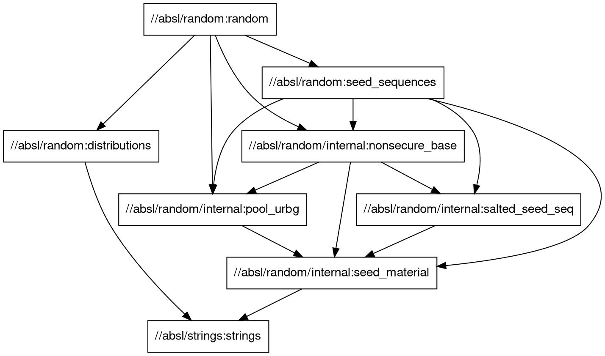
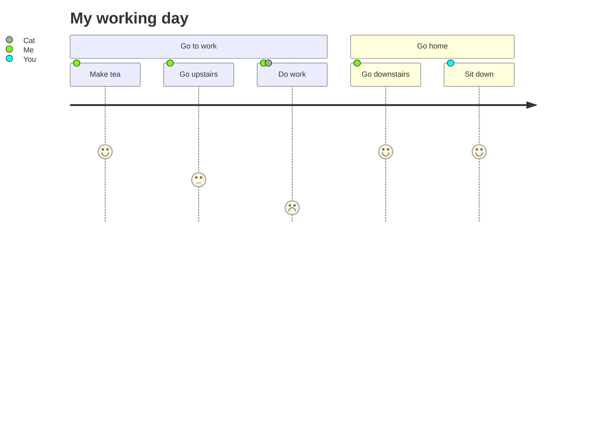

```text
SPAT
├── timeStamp -> MinuteOfTheYear (Optional)
├── name -> DescriptiveName (Optional)
│
├── intersections -> IntersectionStateList
│   └── IntersectionStateList -> Sequence (Max 32) of IntersectionState
│       ├── name -> DescriptiveName (Optional)
│       ├── id -> IntersectionReferenceID
│       │   └── id -> IntersectionID -> Integer 0 through 65535
│       ├── revision -> MsgCount -> Integer 0 through 127
│       ├── status -> IntersectionStatusObject
│       │   └── Bitstring (Size 16) of status indicators
│       ├── moy -> MinuteOfTheYear (Optional)
│       ├── timestamp -> DSecond (Optional)
│       ├── enabledLanes -> EnabledLaneList (Optional)
│       │
│       ├── states -> MovementList
│       │   ├── signalGroup -> SignalGroupID -> Integer 0 through 255
│       │   └── state-time-speed -> MovementEventList
│       │       ├── eventState -> MovementPhaseState -> Enumerated Phase Types
│       │       ├── timing -> TimeChangeDetails (Optional)
│       │       │   ├── startTime -> TimeMark -> Integer
│       │       │   └── minEndTime -> TimeMark -> Integer
│       │       └── speeds -> AdvisorySpeedList (Optional)
│       │
│       ├── maneuverAssistList -> ManeuverAssistList (Optional)
│       ├── regional (Optional)
│       └── roadAuthorityID -> RoadAuthorityID (Optional)
│
└── regional (Optional)
```

